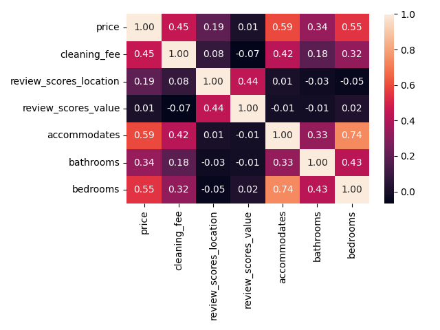
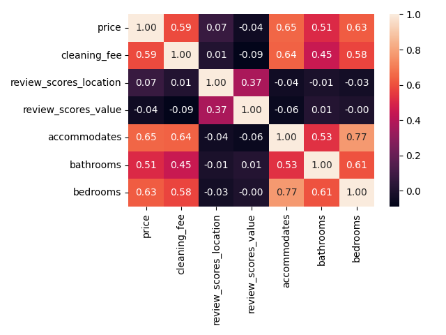

# Udacity Data Scientist Homework Assignment 1
This contains the code for homework 1 in the Udacity Data Scientist Nano Degree. The motivation behind this is to pass the course. As such I decided to look at the provided data sets of airbnb listing data in Bosten and Seattle to answer the following questions:
1. What is the correlation between the following values: 'price', 'cleaning_fee', 'review_scores_location', 'review_scores_value', 'accommodates', 'bathrooms', 'bedrooms'
2. Which of the following variables has the strongest correlation with the listing price: 'room_type', 'accommodates', 'bathrooms', 'bedrooms', 'host_is_superhost',  'beds', 'bed_type', 'cleaning_fee', 'cancellation_policy', 'review_scores_value', 'review_scores_location', 'host_identity_verified'
3. Compare the results of questions 1 and 2 between Bosten and Seattle to look for interesting similarities/differences.

# Libraries used
**Numpy**: A library for numerical computing which allows for efficient operations on multi-dimensional arrays.

**Pandas**: A library for data analysis which provides high-level data structures and tools for working with structured or tabular data.

**Matplotlib**: A library for creating 2D plots and graphs.

**AllTogether**: A library provided by Udacity containing various functions used by this class.

**Seaborn**: A library for data visualization which provides high-level interfaces for drawing attractive and informative statistical graphics.

# Files
**homework_1.ipynb**: Juniper notebook of the code written for this assignment.

**/Bosten and /Seattle**: Contain the respective datasets.

**AllTogether.py and AllTogetherSolns.py**: Contain Udacity provided code used throw-out this class.

**/images**: Contain images produced with the code and used in the readme.

# Summary
**Question 1**: Looking at the data for Bosten, there are clear correlations between certain variables as can be seen in the heatmap below. 

**Heatmap showing the correlation between different variables for the Bosten dataset**

There seems to be a clear positiv correlation between a listing's price and cleaning fees. Furthermore, unsurprisingly, the number of people a listing accommodates as well as the number of bathrooms and bedrooms show a positive correlation with the price as well as with each other. This is not a create surprise as you would expect listings that accommodate more people to be more expensive and require more bath- and bedrooms. 
The review score of a listing shows a positive correlation with its location score. This again is not too surprising since the location score is a major factor of the overall listing score. However, there seems to be no clear correlation between location and overall review score and any other of the values, in particular not the price of the listing. This is somewhat surprising and you could have imagined more expensive listings to receive better review scores or at the very least better location scores.

**Question 2**: Looking at the data for Bosten, a list of the 20 highest correlating values with the listing price looks as follows. 

| BOSTON |                                         |            |           |
|--------|-----------------------------------------|------------|-----------|
|        | est_int                                 | coefs      | abs_coefs |
| 9      | **room_type_Private room**              | -80.361940 | 80.361940 |
| 10     | **room_type_Shared room**               | -73.584597 | 73.584597 |
| 14     | **cancellation_policy_super_strict_30** | 72.254277  | 72.254277 |
| 2      | **bedrooms**                            | 37.644407  | 37.644407 |
| 1      | **bathrooms**                           | 35.593966  | 35.593966 |
| 11     | **bed_type_Real Bed**                   | 18.405890  | 18.405890 |
| 7      | **review_scores_location**              | 18.043700  | 18.043700 |
| 12     | **cancellation_policy_moderate**        | 13.164053  | 13.164053 |
| 6      | **review_scores_value**                 | -6.267840  | 6.267840  |
| 4      | **beds**                                | 5.188895   | 5.188895  |

Strong negative correlation can be seen with the listing type where anything other than the whole house/apt option pulls the price down significantly. Somewhat surprisingly, a super strict cancellation policy in in Boston is the first non room type related variable on the list. Extremely high priced listings in Boston seem to be very strict with their cancellation policy, possibly to avoid hoax bookings or an unreasonably high cancerllation rate for these kind of rentals. Further findings in this list support the earlier findings of the heatmaps that number of accomodated people as well as number of beds, bedrooms and bathrooms all correlate positively with price and are among the top ten.

**Question 3** Comparing the heatmaps for Boston and Seattle one can see an overall similar trend. There does however seem to be significantly stronger correlation between the location rating and the price in Boston compared to Seattle.

**Heatmap showing the correlation between different variables for the Bosten dataset**

**Heatmap showing the correlation between different variables for the Seattle dataset**

In the top ten variables correlating with price we again see similarties with any room type other than whole house/apt showing the strongest negative correlation with price in both cities. Somewhat surprisingly, a super strict cancellation policy in in Boston is the first non room type related variable on the list while it does not show up in Seattle at all. Extremely high priced listings in Boston seem to be very strict with their cancellation policy, possibly to avoid hoax bookings or an unreasonably high cancerllation rate for these kind of rentals. However, why this is not the case in Seattle I am not 100% clear. Further findings in this list support the earlier findings of the heatmaps that number of accomodated people as well as number of beds, bedrooms and bathrooms all correlate positively with price and are among the top ten in both cities.

| BOSTON  |                                         |            |           |
|---------|-----------------------------------------|------------|-----------|
|         | est_int                                 | coefs      | abs_coefs |
| 9       | **room_type_Private room**              | -80.361940 | 80.361940 |
| 10      | **room_type_Shared room**               | -73.584597 | 73.584597 |
| 14      | **cancellation_policy_super_strict_30** | 72.254277  | 72.254277 |
| 2       | **bedrooms**                            | 37.644407  | 37.644407 |
| 1       | **bathrooms**                           | 35.593966  | 35.593966 |
| 11      | **bed_type_Real Bed**                   | 18.405890  | 18.405890 |
| 7       | **review_scores_location**              | 18.043700  | 18.043700 |
| 12      | **cancellation_policy_moderate**        | 13.164053  | 13.164053 |
| 6       | **review_scores_value**                 | -6.267840  | 6.267840  |
| 4       | **beds**                                | 5.188895   | 5.188895  |

| SEATTLE |                                         |            |           |
|---------|-----------------------------------------|------------|-----------|
|         | est_int                                 | coefs      | abs_coefs |
| 10      | **room_type_Shared room**               | -69.368033 | 69.368033 |
| 9       | **room_type_Private room**              | -38.917639 | 38.917639 |
| 2       | **bedrooms**                            | 28.415771  | 28.415771 |
| 1       | **bathrooms**                           | 26.916930  | 26.916930 |
| 7       | **review_scores_location**              | 14.234777  | 14.234777 |
| 13      | **cancellation_policy_moderate**        | -6.406348  | 6.406348  |
| 0       | **accommodates**                        | 6.334792   | 6.334792  |
| 6       | **review_scores_value**                 | -4.474419  | 4.474419  |
| 11      | **bed_type_Futon**                      | 3.574835   | 3.574835  |
| 14      | **cancellation_policy_strict**          | -2.415319  | 2.415319  |

